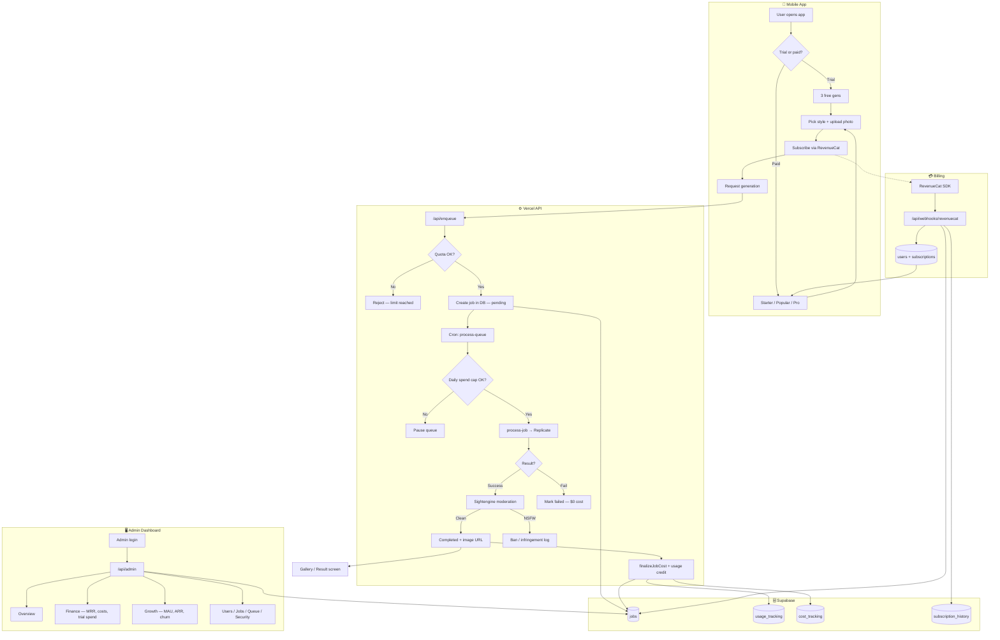
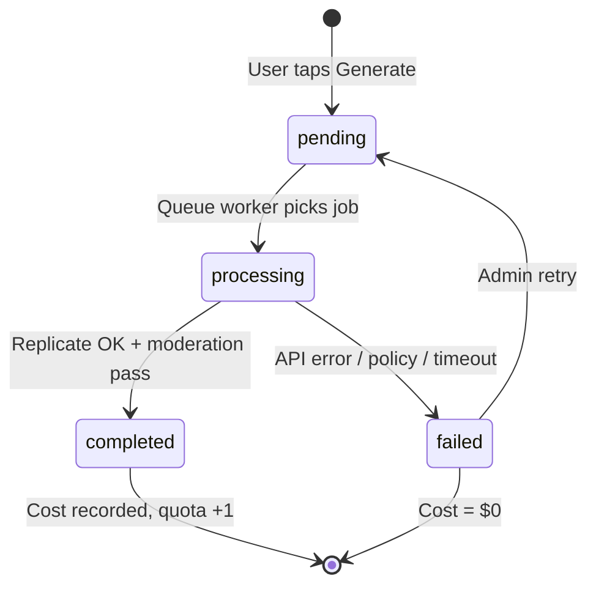
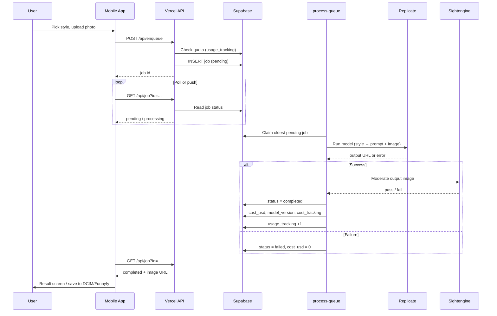
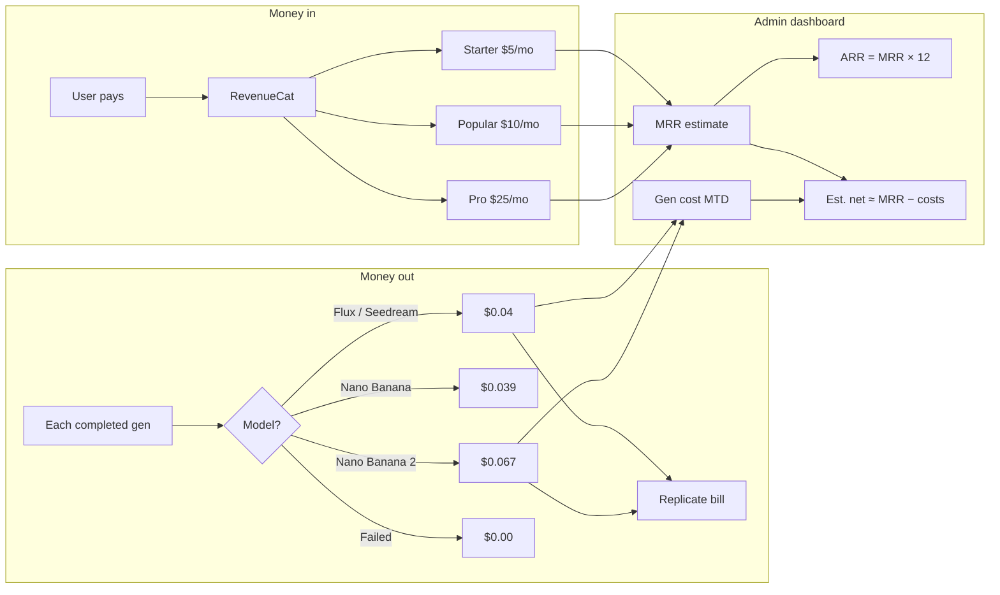
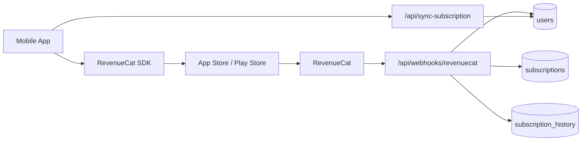
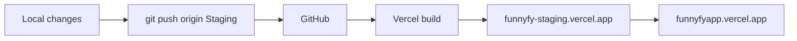

# FunnyFy System Flow

**Status:** Living reference  
**Last updated:** July 2026  
**Related:** `DATABASE_SCHEMA.md`, `SERVER_ARCHITECTURE_EXPLANATION.md`, `REVENUECAT_SETUP.md`

A visual map of how the mobile app, API, billing, generation pipeline, and admin dashboard connect. Use this when the project feels bigger than “upload a photo, get a funny image.”

**View rendered diagrams**

- **Browser (all charts):** open [`FUNNYFY_FLOW.html`](FUNNYFY_FLOW.html) in Chrome/Edge/Firefox  
- **Image files:** [`diagrams/`](diagrams/) — SVG + PNG for each chart (share, print, slide decks)

| Diagram | SVG | PNG |
|---------|-----|-----|
| Big picture | [01-big-picture.svg](diagrams/01-big-picture.svg) | [01-big-picture.png](diagrams/01-big-picture.png) |
| Job lifecycle | [02-job-lifecycle.svg](diagrams/02-job-lifecycle.svg) | [02-job-lifecycle.png](diagrams/02-job-lifecycle.png) |
| Generation sequence | [03-generation-sequence.svg](diagrams/03-generation-sequence.svg) | [03-generation-sequence.png](diagrams/03-generation-sequence.png) |
| Money flow | [04-money-flow.svg](diagrams/04-money-flow.svg) | [04-money-flow.png](diagrams/04-money-flow.png) |
| Billing sync | [05-billing-sync.svg](diagrams/05-billing-sync.svg) | [05-billing-sync.png](diagrams/05-billing-sync.png) |
| Deploy flow | [06-deploy-flow.svg](diagrams/06-deploy-flow.svg) | [06-deploy-flow.png](diagrams/06-deploy-flow.png) |

---

## The big picture



---

## Generation job lifecycle

Every image request becomes a **job** row in Supabase. The queue worker moves it through states.



### Key files

| Step | File |
|------|------|
| Enqueue | `api/enqueue.ts` |
| Queue worker | `api/cron/process-queue.ts` |
| Replicate call | `api/_utils/process-job.ts` |
| Stuck-job recovery | `api/_utils/replicate-sync.ts` |
| NSFW / policy | `api/_utils/sightengine-moderation.ts` |
| Per-job cost | `api/_utils/job-cost.ts` |
| Usage quota | `api/_utils/usage.ts` |
| Daily spend cap | `api/_utils/cost-protection.ts` |

---

## User generation flow (step by step)



---

## Money flow



**Notes**

- MRR/ARR in admin are **estimates** from active subs × rounded tier prices ($5 / $10 / $25), not RevenueCat ledger reconciliation.
- Trial users generate cost but contribute **$0** subscription revenue (called out on Finance page).
- Failed jobs always cost **$0** (no Replicate charge recorded).

---

## Billing & subscription sync



| Event | What updates |
|-------|----------------|
| New purchase | `users.subscription_tier`, `subscription_status = active`, `subscriptions` row |
| Renewal | `subscription_history` renewed event, period dates |
| Cancel | `cancel_at_period_end`, `canceled_at`, history event |
| Expire | `subscription_status = expired` on user + subscription |
| Trial | `subscription_status = trial`, `trial_generations_used` capped at 3 |

---

## Admin dashboard

Served from `api/admin.ts` + `api/_utils/admin-pages/`.

| Menu | Resource | What it shows |
|------|----------|----------------|
| Overview | `stats`, `queue-stats` | Users, jobs, MRR snapshot, alerts |
| Finance | `finance` | MRR, costs MTD, tier economics, model costs, trial spend |
| Growth | `growth` | MAU, total users, MRR, ARR, churn + 6‑month trends |
| Users | `users` | Search, ban, quota, tier |
| Jobs | `jobs` | Retry, cancel, status |
| Queue | `queue-stats` | Pending/processing, spend vs cap |
| Moderation | `moderation` | Infringements |
| Security | `security-logs` | Auth / rate-limit events |

**URLs**

- Staging: `https://funnyfy-staging.vercel.app/admin/login`
- Production: `https://funnyfyapp.vercel.app/admin/login`

**Display currency:** USD/KES toggle converts money client-side using live Frankfurter rate (`api/_utils/exchange-rate.ts`).

---

## Who talks to whom

| Component | Role |
|-----------|------|
| **Mobile app** (`apps/mobile/`) | UI, camera, gallery, RevenueCat purchases |
| **Vercel API** (`api/`) | Auth, enqueue, queue worker, webhooks, admin |
| **Supabase** | Users, jobs, usage, costs, subscriptions |
| **Replicate** | AI image generation (Flux, Seedream, Nano Banana) |
| **Sightengine** | NSFW / content policy on outputs |
| **RevenueCat** | App Store / Play billing + webhooks |
| **Admin dashboard** | Ops, finance, growth metrics |

---

## Deploy flow



Typical staging deploy:

```bash
git push origin Staging
npx vercel deploy --prod --yes
```

DB schema changes are applied manually in the Supabase SQL editor (see `api/migrations-*.sql`).

---

## Mental model (one sentence each)

| Layer | In plain English |
|-------|------------------|
| **What users see** | Pick a style → upload → wait → funny image → gallery |
| **What the server does** | Queue the job, call Replicate safely, moderate, track cost & quota |
| **What billing does** | RevenueCat tells us who paid and which tier |
| **What admin does** | Lets you see money in, money out, users, and broken jobs |

The product feels simple. The **reliability + billing + ops** layer underneath is what makes it a real business.
